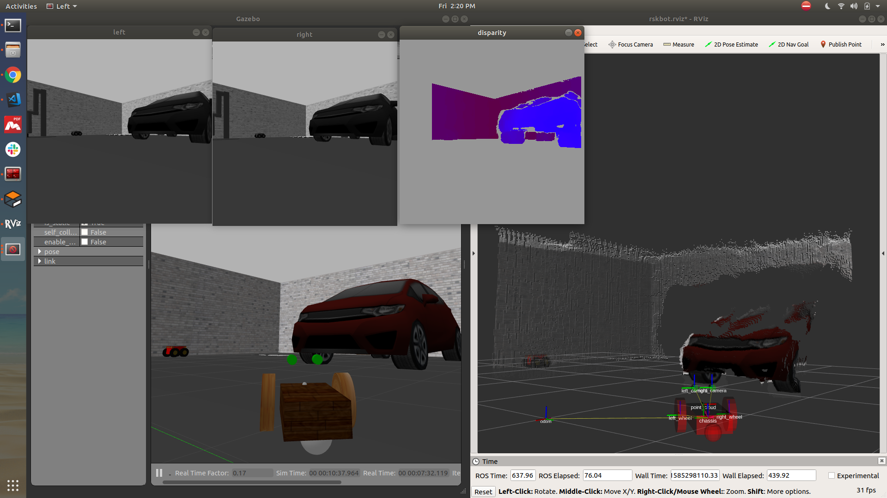

# stereo_to_3d_points_ws #

## Main goal ##
* Make a differential drive robot in Gazebo Simulation with a stereo camera mounted on top.
* The robot should be controlled from Keyboard.
* Then corresponding 3D points of what robot sees should be plotted in Rviz

## Dependencies ##
Make sure you have ROS installed.

2 packages should be pre installed:
* stereo\_image_proc
* image_view

These packages comes pre-installed with the ROS environment.

You can check the availability of package using:
* rospack list | grep stereo\_image_proc
* rospack list | grep image_view

## To run the project ##
* Clone this repository or just download the zip file and extract
* Inside the downloaded folder run : catkin_make  (for the first time only)
* Inside the downloaded folder run **rskbot_run.sh** script (i.e  ./rskbot_run.sh )

